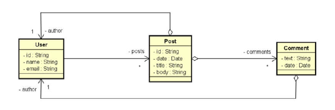

# API Restful com Spring Boot e banco MongoDB

# Sobre o projeto
API Restful com Spring Boot e banco MongoDB (web service + NoSQL) é uma aplicação desenvolvida durante o curso de Java Completo 2023 do site Udemy, aplicado pelo professor Nelio Alves.

A aplicação consiste em um blog onde usuários fazem postagem e recebem comentários sobre os posts. Ela é BackEnd constituído por controladores REST, camada de serviços, camada de acesso a dados (Repository) e camada de domínio.

## Modelo de Dados Agregado

# Tecnologias utilizadas
- Java
- Spring Boot
- MongoDB
- Postman
